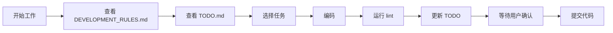

# 🚀 开发规则设置指南

## 1. VSCode 配置（推荐）

### 安装 Todo Tree 插件
已配置好，可以在侧边栏看到所有TODO

### 设置启动提醒
1. 打开 VSCode 设置
2. 搜索 "workbench.tips.enabled"  
3. 确保启用
4. 每次打开项目会看到 `.vscode/claude-code-checklist.md`

## 2. Git Hooks 设置（可选）

### Windows (Git Bash)
```bash
# 复制 pre-commit hook
cp scripts/pre-commit.sh .git/hooks/pre-commit
chmod +x .git/hooks/pre-commit
```

### Mac/Linux
```bash
# 链接 pre-commit hook
ln -s ../../scripts/pre-commit.sh .git/hooks/pre-commit
```

## 3. 浏览器书签

建议添加以下书签：
- `DEVELOPMENT_RULES.md` - 开发规则
- `TODO.md` - 任务清单
- `TODO_DECISION_TEMPLATE.md` - 决策模板

## 4. 日常工作流程



## 5. 快速命令别名（可选）

在 `~/.bashrc` 或 `~/.zshrc` 添加：

```bash
# 项目快捷命令
alias dev-rules='code DEVELOPMENT_RULES.md'
alias dev-todo='code TODO.md'
alias dev-check='npm run lint && echo "✅ Lint passed"'
alias dev-start='npm run dev'
```

## 6. IDE 代码片段

VSCode 中按 `Ctrl+Shift+P`，选择 "Configure User Snippets"，添加：

```json
{
  "TODO Comment": {
    "prefix": "todo",
    "body": [
      "// TODO [P${1|0,1,2|}]: ${2:description}",
      "// 原因：${3:why}"
    ]
  },
  "IDEA Comment": {
    "prefix": "idea",
    "body": [
      "// IDEA: ${1:description}",
      "// 优点：${2:pros}",
      "// 缺点：${3:cons}",
      "// 状态：待评估"
    ]
  }
}
```

## 7. 每日检查清单

### 早上开始
- [ ] 查看 DEVELOPMENT_RULES.md 有无更新
- [ ] 检查 TODO.md 优先级
- [ ] 确认本地服务运行正常

### 提交代码前
- [ ] 运行 `npm run lint`
- [ ] 更新 TODO.md
- [ ] 检查没有违反开发规则

### 下班前
- [ ] 更新进行中任务状态
- [ ] 记录明天的计划

---

💡 **提示**：将 DEVELOPMENT_RULES.md 设为浏览器首页，每天第一眼就能看到！