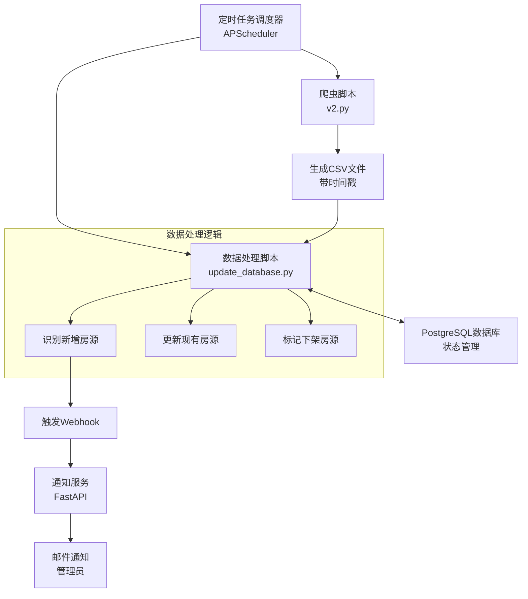

# Sydney Rental Hub - 自动化数据管道 (ETL Pipeline)

这是一个完整的自动化数据管道系统，用于：
- 定时爬取悉尼租房数据
- 增量更新数据库
- 识别新增、更新、下架的房源
- 发送新房源通知

## 🏗️ 架构概览



## 📁 文件结构

```
etl/
├── README.md                    # 本文档
├── requirements.txt             # Python依赖
├── add_last_seen_field.sql     # 数据库迁移脚本
├── update_database.py          # 核心数据处理脚本
├── scheduler.py                 # 定时任务调度器
├── notification_service.py     # 通知服务
└── process_csv.py              # 原有ETL脚本（已废弃）
```

## 🚀 快速开始

### 1. 安装依赖

```bash
# 进入ETL目录
cd rentalAU_mcp/etl

# 安装Python依赖
pip install -r requirements.txt
```

### 2. 数据库迁移

```bash
# 应用数据库迁移，添加必要字段
psql -h localhost -U etl_user -d rental_mcp_db -f add_last_seen_field.sql
```

### 3. 配置环境变量

```bash
# 复制环境变量模板
cp ../.env.example ../.env

# 编辑配置文件
nano ../.env
```

必须配置的变量：
```bash
# 数据库连接
DB_PASSWORD="your_db_password"

# 通知配置（可选）
WEBHOOK_URL="http://localhost:8001/webhook/new-listings"
ADMIN_EMAIL="admin@example.com"
SMTP_USERNAME="your_email@gmail.com"
SMTP_PASSWORD="your_app_password"
```

### 4. 测试各个组件

#### 测试数据处理脚本
```bash
python update_database.py
```

#### 测试通知服务
```bash
# 启动通知服务
python notification_service.py

# 在另一个终端测试通知
curl -X POST "http://localhost:8001/test/notification"
```

#### 测试完整管道
```bash
# 手动运行一次完整流程
python scheduler.py
```

### 5. 启动自动化调度

```bash
# 启动调度器（会根据配置定时执行）
python scheduler.py
```

## ⚙️ 详细配置

### 调度配置

在 `.env` 文件中配置调度时间：

```bash
# 完整管道调度（推荐）
PIPELINE_SCHEDULE="0 */8 * * *"  # 每8小时执行一次

# 或者分别调度（高级用法）
SEPARATE_SCHEDULING="true"
SPIDER_SCHEDULE="0 */6 * * *"      # 爬虫每6小时
DATA_UPDATE_SCHEDULE="15 */6 * * *"  # 数据更新延后15分钟
```

### 通知配置

#### 邮件通知设置

1. **Gmail配置**（推荐）：
   ```bash
   SMTP_SERVER="smtp.gmail.com"
   SMTP_PORT="587"
   SMTP_USERNAME="your_email@gmail.com"
   SMTP_PASSWORD="your_app_password"  # 应用专用密码
   ```

2. **获取Gmail应用密码**：
   - 启用两步验证
   - 生成应用专用密码
   - 使用应用密码而非登录密码

#### Webhook通知

默认配置下，新房源会通过Webhook发送到本地通知服务：
```bash
WEBHOOK_URL="http://localhost:8001/webhook/new-listings"
```

## 🔧 核心组件说明

### 1. update_database.py - 数据处理核心

**功能**：
- 读取最新的爬虫CSV文件
- 与数据库现有数据对比
- 识别新增、更新、下架的房源
- 更新数据库状态
- 发送新房源通知

**关键逻辑**：
- **新增房源**：CSV中有，数据库中没有
- **更新房源**：CSV和数据库中都有，更新信息和`last_seen_at`
- **下架房源**：数据库中有，CSV中没有，标记`is_active=false`

**使用方法**：
```bash
python update_database.py
```

### 2. scheduler.py - 任务调度器

**功能**：
- 基于APScheduler的定时任务系统
- 自动执行爬虫和数据更新
- 支持多种调度策略
- 完整的日志记录

**调度模式**：

1. **完整管道模式**（推荐）：
   ```bash
   SEPARATE_SCHEDULING="false"
   PIPELINE_SCHEDULE="0 */8 * * *"
   ```

2. **分离调度模式**（高级）：
   ```bash
   SEPARATE_SCHEDULING="true"
   SPIDER_SCHEDULE="0 */6 * * *"
   DATA_UPDATE_SCHEDULE="15 */6 * * *"
   ```

**使用方法**：
```bash
# 前台运行（开发测试）
python scheduler.py

# 后台运行（生产环境）
nohup python scheduler.py > scheduler.log 2>&1 &
```

### 3. notification_service.py - 通知服务

**功能**：
- FastAPI微服务
- 接收新房源Webhook通知
- 发送邮件通知给管理员
- 记录通知日志

**API端点**：
- `GET /` - 健康检查
- `GET /health` - 详细状态
- `POST /webhook/new-listings` - 接收新房源通知
- `POST /test/notification` - 测试通知功能

**使用方法**：
```bash
# 启动服务
python notification_service.py

# 或指定端口
uvicorn notification_service:app --host 0.0.0.0 --port 8001
```

## 🧪 测试指南

### 1. 单元测试

```bash
# 测试数据处理
python update_database.py

# 测试通知服务
curl -X POST "http://localhost:8001/test/notification"

# 检查健康状态
curl "http://localhost:8001/health"
```

### 2. 集成测试

```bash
# 测试完整流程
export RUN_ON_STARTUP="true"
python scheduler.py
```

### 3. 数据验证

```sql
-- 检查最近更新的房源
SELECT COUNT(*) as total_active FROM properties WHERE is_active = true;

-- 检查最近添加的房源
SELECT COUNT(*) as new_today 
FROM properties 
WHERE created_at >= CURRENT_DATE;

-- 检查最近下架的房源
SELECT COUNT(*) as inactive_today 
FROM properties 
WHERE is_active = false 
AND last_updated >= CURRENT_DATE;
```

## 📊 监控和日志

### 日志文件位置
- `scheduler.log` - 调度器日志
- `notifications.log` - 通知记录
- 控制台输出 - 实时处理状态

### 关键指标监控
1. **数据更新频率** - 确保按计划执行
2. **新房源数量** - 监控数据源健康度
3. **下架房源比例** - 识别数据质量问题
4. **通知发送成功率** - 确保通知系统正常

### 日志示例
```
2025-07-07 15:00:00 - Starting property data update process...
2025-07-07 15:00:05 - Found 2138 existing active listings in database
2025-07-07 15:00:10 - Data analysis complete:
  - New listings: 25
  - Listings to update: 2100
  - Listings to mark inactive: 13
2025-07-07 15:00:30 - Successfully inserted 25 new listings
2025-07-07 15:00:35 - Successfully updated 2100 existing listings
2025-07-07 15:00:40 - Successfully marked 13 listings as inactive
2025-07-07 15:00:45 - Successfully sent notification for 25 new listings
```

## 🚨 故障排除

### 常见问题

1. **数据库连接失败**
   ```
   错误：psycopg2.OperationalError: could not connect to server
   解决：检查DB_PASSWORD和数据库服务状态
   ```

2. **CSV文件未找到**
   ```
   错误：FileNotFoundError: No CSV files found
   解决：确保爬虫已执行并生成CSV文件
   ```

3. **邮件发送失败**
   ```
   错误：smtplib.SMTPAuthenticationError
   解决：检查邮箱配置和应用密码
   ```

4. **调度器无响应**
   ```
   解决：检查cron表达式格式和时区设置
   ```

### 调试模式

启用详细日志：
```bash
export LOG_LEVEL="DEBUG"
python update_database.py
```

### 手动恢复

如果自动化流程出现问题，可以手动执行：

```bash
# 1. 手动运行爬虫
cd rentalAU_mcp
python v2.py

# 2. 手动处理数据
cd etl
python update_database.py

# 3. 手动测试通知
curl -X POST "http://localhost:8001/test/notification"
```

## 🔒 安全注意事项

1. **环境变量保护**
   - 不要将 `.env` 文件提交到版本控制
   - 使用强密码和应用专用密码
   - 定期轮换敏感凭据

2. **网络安全**
   - 使用HTTPS（生产环境）
   - 限制数据库访问IP
   - 配置防火墙规则

3. **数据保护**
   - 定期备份数据库
   - 监控异常访问
   - 实施数据保留策略

## 📈 性能优化

### 数据库优化
```sql
-- 添加有用的索引
CREATE INDEX IF NOT EXISTS idx_properties_last_seen ON properties(last_seen_at);
CREATE INDEX IF NOT EXISTS idx_properties_created_active ON properties(created_at, is_active);

-- 定期清理旧数据（可选）
DELETE FROM properties 
WHERE is_active = false 
AND last_updated < NOW() - INTERVAL '90 days';
```

### 调度优化
- 避免高峰时段运行
- 根据数据源更新频率调整调度
- 监控资源使用情况

## 🚀 部署建议

### 开发环境
```bash
# 使用立即执行测试
export RUN_ON_STARTUP="true"
export PIPELINE_SCHEDULE="*/30 * * * *"  # 每30分钟测试
python scheduler.py
```

### 生产环境
```bash
# 使用系统服务
sudo systemctl create rental-etl.service
sudo systemctl enable rental-etl.service
sudo systemctl start rental-etl.service
```

### Docker部署（推荐）
```dockerfile
FROM python:3.10-slim
WORKDIR /app
COPY requirements.txt .
RUN pip install -r requirements.txt
COPY . .
CMD ["python", "scheduler.py"]
```

## 📝 更新日志

### v1.0.0 (2025-07-07)
- ✅ 完整的自动化数据管道
- ✅ 增量数据更新逻辑
- ✅ 软删除房源状态管理
- ✅ 新房源通知系统
- ✅ 邮件通知支持
- ✅ 定时任务调度
- ✅ 完整的日志记录

---

## 📞 支持

如果遇到问题或需要功能改进，请：
1. 检查日志文件获取详细错误信息
2. 参考故障排除部分
3. 确保所有依赖正确安装
4. 验证环境变量配置

**Sydney Rental Hub ETL Pipeline** - 让房源数据管理变得简单高效！ 🏠✨
