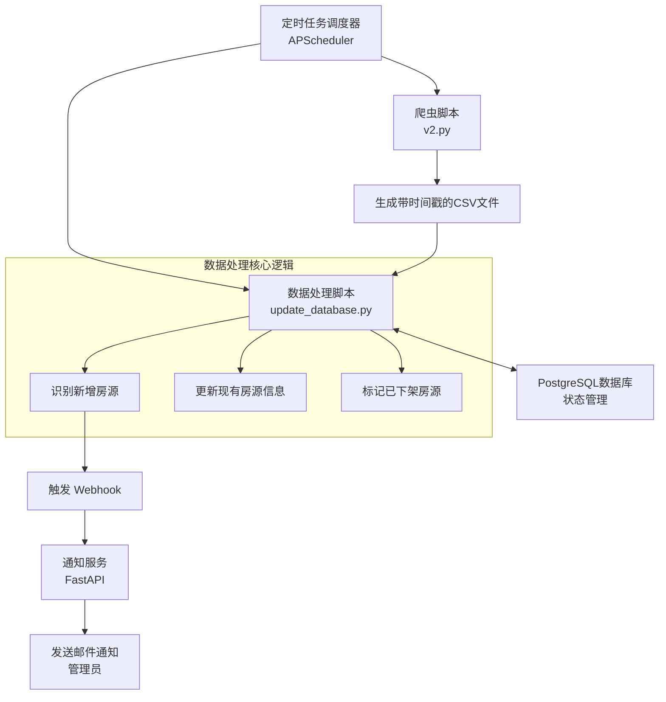

# 悉尼租房中心 - 自动化数据管道 (ETL 流程)


本文档详细说明了一个完整的自动化数据管道系统，其核心功能包括：

__项目概述__

这个 `database` 文件夹是整个项目&#x7684;__&#x6570;据心脏和引擎__。它不仅定义了核心数据结构，还包含了一整套自动化脚本，用于处理、清洗、导入和维护房源数据。这套系统被称为 __ETL (Extract, Transform, Load) 管道__。

__核心功能与目的__

1. __数据库结构定义 (`.sql` 文件)__：

   - `setup_database.sql`：这是项目的起点，它创建了名为 `properties` 的核心数据表，定义了房源的所有字段（如地址、租金、卧室数量等），并为常用查询字段建立了索引以提高性能。
   - __迁移脚本__ (如 `migration_add_property_features_v3.sql`)：这些脚本用于在不删除现有数据的情况下，对数据库表结构进行更新和演进（例如，为房源添加“是否有对讲机”这样的新特性）。这表明项目是可迭代、可扩展的。
2. __自动化数据处理 (`.py` 文件)__：

   - `process_csv.py` & `update_database.py`：这些是 ETL 管道的核心 Python 脚本。它们负责执行以下关键任务：

     - __提取 (Extract)__：自动查找并读取爬虫程序生成的最新房源数据（CSV 文件）。
     - __转换 (Transform)__：对原始数据进行大量的清洗和格式化，例如将文本“TRUE”转换为布尔值 `True`，处理空值，转换日期格式等，以确保数据的一致性和质量。
     - __加载 (Load)__：以一种非常智能的方式将处理好的数据加载到 PostgreSQL 数据库中。它会自动对比新旧数据，实现：

       - __增量更新__：只添加新出现的房源。
       - __信息变更__：更新现有房源变化了的信息（如租金）。
       - __状态管理__：自动将在新数据中消失的房源标记为“已下架”(inactive)，而不是直接删除。
   - `populate_serviced_routes.py` & `process_gtfs_stops.py`：这些是处理交通和通勤数据的特定脚本，用于支持通勤时间计算等高级功能。
3. __文档与验证__：

   - `README.md`：提供了非常详细的说明，解释了整个 ETL 管道的架构、如何安装、配置和运行这些脚本。
   - `verification_queries.sql`：提供了一系列 SQL 查询语句，用于在数据更新后验证数据的正确性（例如，查询今天新增了多少房源）。

__总结__

`database` 文件夹不仅仅是几个 SQL 文件，它是一&#x5957;__&#x5B8C;整、自动化、且设计精良的数据处理系统__。它确保了您整个应用的数据来源是可靠、干净且持续更新的。

简单来说，如果说您的项目是一辆车，那么 `database` 文件夹就是这辆车&#x7684;__&#x5F15;擎、油箱和输油管路__，它为前端和后端的所有功能提供了源源不断的动力——__高质量的数据__。

- 定时爬取最新的悉尼租房数据。
- 对数据库进行增量更新。
- 智能识别新增、信息变更及已下架的房源。
- 为新房源发送通知。

---


## 🏗️ 架构概览



## 📁 文件结构

```
database/
├── README.md                    # 本文档
├── setup_database.sql           # 数据库初始表结构
├── migration_*.sql              # 数据库迁移脚本
├── update_database.py           # 核心数据处理与ETL脚本
├── process_csv.py               # (已废弃) 旧版ETL脚本
├── verification_queries.sql     # 用于验证数据正确性的SQL查询
└── ... (其他辅助脚本)
```

## 🚀 快速开始

### 1. 环境准备

- 确保 Python 环境已激活。
- 确保 PostgreSQL 和 Redis 服务正在运行 (推荐使用 Docker)。

### 2. 安装依赖

```bash
# 假设您在项目根目录
pip install -r requirements.txt
```

### 3. 数据库初始化与迁移

首先，您需要一个空的数据库。然后执行初始化和迁移脚本。

```bash
# 1. 初始化核心表结构
psql -h localhost -U your_user -d your_db -f database/setup_database.sql

# 2. 应用所有迁移脚本 (按顺序)
psql -h localhost -U your_user -d your_db -f database/migration_add_property_features_v3.sql
# ... 其他迁移脚本
```

### 4. 配置环境变量

在项目根目录的 `.env` 文件中，确保以下数据库变量已正确配置：

```env
DB_NAME=your_db_name
DB_USER=your_user
DB_PASSWORD=your_db_password
DB_HOST=localhost
DB_PORT=5432
```

### 5. 运行数据处理脚本

此脚本是ETL流程的核心，负责将爬虫生成的CSV文件处理并导入数据库。

```bash
# 手动运行一次ETL流程
python database/update_database.py
```

## 🔧 核心组件说明

### `setup_database.sql`

定义了项目核心 `properties` 表的完整结构，包括所有字段、数据类型和索引。这是您在部署一个全新环境时需要执行的第一个脚本。

### `migration_*.sql` (迁移脚本)

用于在现有数据库上进行迭代式更新。例如，当爬虫抓取到新的房源特征时，我们会创建一个新的迁移脚本来为 `properties` 表添加新的列，而不是删除重建整个表。这保证了数据的连续性。

### `update_database.py` / `process_csv.py`

这是ETL（提取、转换、加载）过程的核心。它的主要工作包括：

- **提取 (Extract)**: 找到最新的由爬虫生成的房源数据CSV文件。
- **转换 (Transform)**: 清洗和格式化数据，例如处理空值、转换数据类型、统一布尔值等。
- **加载 (Load)**: 以智能的方式将数据加载到数据库。它会：
  - **对比**新旧数据。
  - **插入**数据库中不存在的新房源。
  - **更新**信息已变更的现有房源（例如租金变化）。
  - **标记**在新数据中已消失的房源为“下架”状态 (`is_active = false`)。

### `verification_queries.sql`

包含一系列用于数据审计的SQL查询。在数据更新后，您可以使用这些查询来验证操作是否成功，例如：

- 查询当天新增了多少房源。
- 查询有多少房源被标记为下架。
- 检查活跃房源的总数。

## 📈 工作流程

1. **爬虫运行**: 爬虫程序抓取最新的房源信息，并生成一个CSV文件。
2. **ETL执行**: `update_database.py` 脚本被触发（可以手动或通过定时任务）。
3. **数据处理**: 脚本读取CSV，进行数据清洗，并与数据库中的现有数据进行对比。
4. **数据库更新**: 脚本执行 `INSERT`（新增）、`UPDATE`（更新）和 `UPDATE ... SET is_active = false`（下架）操作。
5. **完成**: 数据库中的数据得到更新，反映了房源市场的最新状态。

---

**悉尼租房中心数据管道** - 让房源数据管理变得简单、高效、可靠。 🏠✨
