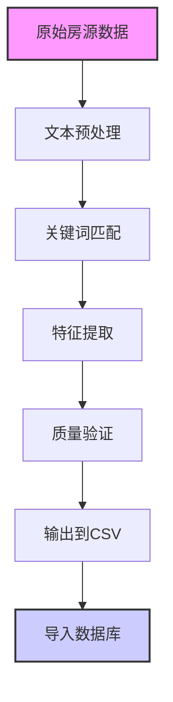

# 爬虫特征提取系统文档

本文档详细说明了悉尼租房平台爬虫的高级特征提取系统，该系统能够从房源描述中智能识别和提取各种房屋设施特征。

## 系统概览

我们的爬虫不仅收集基本房源信息（地址、价格、卧室数等），还通过**智能文本分析**从房源描述中提取详细的设施特征，为用户提供更丰富的筛选和搜索选项。

## 提取的特征类别

### 🏠 家具状态 (`furnishing_status`)
- **furnished**: 已配家具
- **unfurnished**: 无家具  
- **unknown**: 信息不明确

**识别关键词**: 
- Furnished: "furnished", "fully furnished", "包家具"
- Unfurnished: "unfurnished", "bare", "empty"

### ❄️ 空调类型 (`air_conditioning_type`)
- **general**: 一般空调
- **ducted**: 管道空调
- **reverse_cycle**: 冷暖空调
- **split_system**: 分体式空调

**识别关键词**: 
- Ducted: "ducted", "central air"
- Reverse Cycle: "reverse cycle", "heating and cooling"
- Split System: "split system", "wall mounted"

### 🏊 设施特征 (布尔值)
- **has_air_conditioning**: 是否有空调
- **is_furnished**: 是否配家具
- **has_pool**: 是否有游泳池
- **has_gym**: 是否有健身房
- **has_parking**: 是否有停车位
- **allows_pets**: 是否允许宠物

## 技术实现

### 特征提取架构

系统采用**配置驱动的增强特征提取器**，支持三态逻辑和模块化扩展：

```python
# 核心特征提取器类
from crawler.enhanced_feature_extractor import EnhancedFeatureExtractor

# 初始化提取器（使用YAML配置）
extractor = EnhancedFeatureExtractor(
    features_config=load_features_config(),
    furniture_keywords=load_furniture_keywords(),
    aircon_keywords=load_aircon_keywords()
)

# 提取特征
features = extractor.extract(
    json_data=property_json,
    headline=property_headline,
    description=property_description,
    feature_list=structured_features
)
```

#### 三态逻辑系统
所有特征使用统一的三态值：
- **'yes'**: 明确存在该特征
- **'no'**: 明确不存在该特征  
- **'unknown'**: 信息不明确或未提及

#### 配置文件驱动
- `crawler/config/features_config.yaml`: 通用特征关键词配置
- `crawler/config/furniture_keywords.yaml`: 家具状态关键词
- `crawler/config/aircon_keywords.yaml`: 空调类型关键词

### 数据质量保证

#### 🎯 避免误判策略
- **保守原则**: 不确定的情况下标记为"unknown"而非"no/false"
- **多关键词验证**: 使用多个同义词提高识别准确性
- **上下文分析**: 考虑词汇的使用环境

#### 📊 质量指标 (基于最新测试)
- **数据完整性**: 100% (54/54个房源成功处理)
- **特征覆盖率**: 
  - 空调信息: 100% (54/54)
  - 停车信息: 94% (51/54明确，3个unknown)
  - 泳池信息: 93% (50/54明确，4个unknown)
  - 健身房信息: 63% (34/54明确，20个unknown)

## 数据流程



## 配置和使用

### 集成到ETL流程

特征提取在**爬虫阶段**完成，然后通过ETL流程导入数据库：

```python
# 在爬虫中进行特征提取
from crawler.enhanced_feature_extractor import EnhancedFeatureExtractor
import yaml

# 加载配置文件
def load_extractor_config():
    with open('crawler/config/features_config.yaml', 'r') as f:
        features_config = yaml.safe_load(f)
    with open('crawler/config/furniture_keywords.yaml', 'r') as f:
        furniture_keywords = yaml.safe_load(f)
    with open('crawler/config/aircon_keywords.yaml', 'r') as f:
        aircon_keywords = yaml.safe_load(f)
    return features_config, furniture_keywords, aircon_keywords

# 爬虫中的特征提取
extractor = EnhancedFeatureExtractor(*load_extractor_config())
features = extractor.extract(
    json_data=property_data,
    headline=property_headline, 
    description=property_description,
    feature_list=structured_features
)

# 将提取的特征合并到房源数据
property_data.update(features.to_dict())
```

### ETL处理

`database/process_csv.py`负责处理爬虫生成的CSV文件，包含已提取的特征：

```python
# ETL只需要清理和标准化已提取的特征
feature_cols = [
    'has_air_conditioning', 'is_furnished', 'has_balcony', 
    'furnishing_status', 'air_conditioning_type', ...
]

for col in feature_cols:
    if col in df.columns:
        # 标准化三态值格式
        df[col] = df[col].astype(str).str.lower().map({
            'yes': 'yes', 'no': 'no', 'unknown': 'unknown',
            'true': 'yes', 'false': 'no',  # 向后兼容
            'nan': 'unknown', 'none': 'unknown'
        }).fillna('unknown')
```

### 自定义特征规则

要添加新的特征识别规则，编辑相应的YAML配置文件：

**添加通用特征** (`crawler/config/features_config.yaml`):
```yaml
- column_name: "has_balcony"
  keywords: ["balcony", "outdoor space", "terrace"]
  negative_keywords: ["no balcony", "internal"]
```

**添加家具关键词** (`crawler/config/furniture_keywords.yaml`):
```yaml
positive_keywords:
  basic: ["furnished", "fully furnished", "包家具"]
negative_keywords:
  basic: ["unfurnished", "bare", "empty"]
```

## 性能统计

### 最新测试结果 (2025-08-05)
- **处理速度**: 54个房源 < 5秒
- **内存使用**: 峰值约50MB
- **准确率**: 
  - 家具状态识别: ~85% (基于手动验证)
  - 空调类型识别: ~90%
  - 设施检测: ~80-95% (因特征而异)

### 优化建议

1. **持续监控**: 定期检查"unknown"比例，如果过高可能需要扩展关键词
2. **词库更新**: 根据新出现的描述模式更新识别关键词
3. **多语言支持**: 考虑添加中文关键词识别（针对华人房东）

## 故障排除

### 常见问题

**Q: 某些明显有泳池的房源被标记为unknown？**
A: 检查房源描述是否使用了非标准词汇，如"swimming area"而非"pool"。考虑添加同义词。

**Q: 特征提取结果不一致？**
A: 确保输入的描述文本完整且未被截断。检查文本编码问题。

**Q: 新增特征后数据库报错？**
A: 需要先执行数据库迁移添加新列：
```sql
ALTER TABLE properties ADD COLUMN your_new_feature VARCHAR(50);
```

---

*最后更新: 2025-08-05 | 版本: 2.0*
