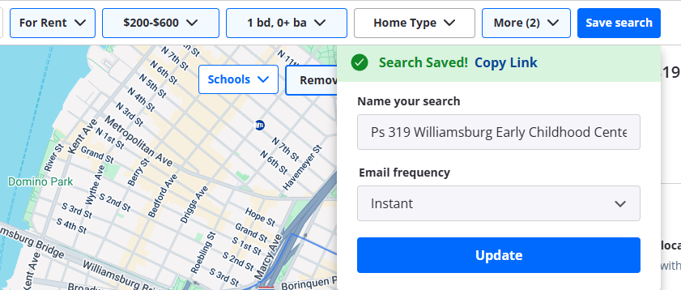

# 当前上下文与紧急焦点
最后更新：2025-09-16

## 当前状态
- **服务运行**：前端 :5173 / 后端 :8000 正常；数据库连接正常；Directions API 配置完好
- **最新完成**：
  - 筛选系统重构：创建了新的线性四步筛选流程
  - useFilterWizard Composable：简化状态管理，统一筛选逻辑
  - FilterWizard 组件：实现向导式筛选体验
  - SearchResultHeader 组件：智能中文化结果描述
  - SaveSearchModal 组件：Zillow风格的保存搜索弹窗
  - FilterTabs 组件：集成保存搜索按钮（PC端和移动端）
  - useFilterWizard 扩展：完整的保存搜索功能支持
  - HomeView 集成：完整的事件处理链路和用户反馈
  - 保存搜索功能：完整实现并测试通过
- **当前焦点**：保存搜索功能已完整实现，下一步开发已保存搜索管理界面

## 下一步计划
- **[P0] Profile 页结构化**：收藏概览（最近3条 + 总数 + 查看全部 → /favorites）、历史浏览入口、已保存筛选占位，严格使用"新页面视觉标准 v1"
- **[P0] 保存筛选（本地版）**：FilterPanel 顶部"保存/订阅"入口 + Profile"我的筛选"管理占位
- **[P1] 令牌定义梳理**：assets/design-tokens.css 标注 deprecated（--color-accent/--font-size-base/--spacing-lg）并提供语义映射
- **[P1] 图标系统统一**：components/icons/* 点扫描，迁移至 lucide-vue-next + currentColor
- **[P2] 移除 var() 颜色兜底**：渐进清理 var(--token, #xxx) fallback

## 技术提醒
- **筛选系统**：V1 契约稳定，V2 映射默认关闭（enableFilterV2=false），可安全回滚
- **设计令牌**：Stylelint 护栏已启用，新代码强制使用 var(--*)，禁止硬编码颜色
- **Memory Bank 维护**：activeContext 仅保留当前与未来任务快照，已完成功能沉淀到 systemPatterns/progress
- **运维约束**：本地固定用 PowerShell 执行 Python/SQL/HTTP，避免跨壳路径问题
