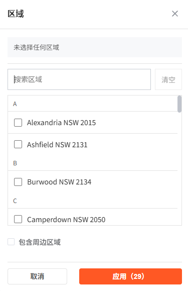

# 项目进展与演进（精简版）

说明
- 仅保近 30 天里程碑（每条 ≤3 行）；超过 30 天仅保“标题 + 溯源”。
- 详细过程请查看对应 commit/PR；Memory Bank 不再复制过程性细节。

近 30 天里程碑
- 2025-09-10｜TYPOGRAPHY+I18N-V1  
  建立文字 Design Tokens（styles/typography.css）与轻量 i18n 合并机制（i18n/locales/zh-CN.js + index.js）；试点重构 PropertyCard：价格/单位/新徽标/更多菜单/辅助文案接入 $t 与 .typo-*。前端表现：UI 中文化、文字节奏统一、动态地址仍英文｜溯源：commit 3e4ea72..c45d86a
- 2025-09-10｜UI-COLOR-BLUE-NEW-BADGE & ADD-LOCATION-SECONDARY  
  PropertyCard “New” 徽标改为品牌蓝（--brand-primary），文字用 --color-text-inverse；CommuteTimes “Add location” 按钮硬编码红替换为次要按钮令牌（secondary），补充 hover/focus 可达性。前端表现：新标签为蓝色、按钮中性灰一致化｜溯源：commit 3c7c150..3e4ea72
- 2025-09-10｜UI-TOKENS-PC-FILTER-LOCATION  
  PC 分离式筛选标签与 Add/Name Location 弹窗全面令牌化；FilterTabs 激活态→中性选中底；价格滑块硬编码清理，统一走 tokens。前端表现：点击“卧室/价格/更多”与弹窗流程不再出现旧色｜溯源：commit 82c3f37..3c7c150
- 2025-09-10｜LINT-GUARDRAIL-COLOR  
  扩展 stylelint 拦截 background/border/outline/fill/stroke 的硬编码色与 rgba/hsla，强制使用 var(--*)；保留 design-tokens.css 与 style.css 的定义豁免，阻断新增硬编码进入｜溯源：commit 82c3f37..3c7c150
- 2025-09-10｜DESIGN-TOKEN-COLOR-3  
  新增全局语义色令牌（link visited/disabled；success/warn/danger/info soft-bg/border；favorite 三态；badge；divider；inverse/弱底；brand 别名）；并对公用样式做小范围等价替换（建议项边框/悬浮、卡片次要文案、筛选按钮激活态）。前端表现：自动补全 hover/分隔线中性化，卡片副文为次级灰，筛选激活为中性选中底色｜溯源：commit ff73605..69c3e0e
- 2025-09-09｜INSPECTION-TIME-NAN-FIX  
  修复房源列表卡片显示"开放时间：NaN"问题：新增 hasValidInspectionTime 计算属性严格验证数据有效性，增强 formatInspectionTime 函数添加输入验证，更新模板条件渲染；前端表现：无有效看房时间时完全隐藏开放时间模块，与详情页修复保持一致｜溯源：commit 7ff2e6c
- 2025-09-09｜SUPABASE-DATA-SYNC-P0
  修复 Supabase 同步滞后与邮编小数点：ETL 扩展更新判定（available_date/inspection_times/postcode/property_headline），统一 postcode 为4位字符串；前端表现：看房时间/空出日期与CSV一致，“NSW 2010.0”→“NSW 2010”。｜溯源：commit 53ff509..1b96baa
- 2025-09-08｜SORT-P0  
  列表排序功能落地：后端 /api/properties 支持 sort 白名单（price_asc/available_date_asc/suburb_az/inspection_earliest；inspection_earliest 暂等价 available_date_asc），稳定次序 listing_id ASC；前端 fetchProperties 统一兜底跨页保留排序｜溯源：commit 7bd269b..54ba6c1
- 2025-09-08｜REGION-FILTER-P0-FIX  
  区域筛选彻底修复（V1 契约）：仅选“邮编”时自动展开为多个 suburb 注入 suburb CSV；计数与列表口径一致；本地目录聚合 postcode.suburbs 兜底｜溯源：commit a331c69..27b9cf6
- 2025-09-08｜FURNISHED-FILTER-FIX-V1  
  前端按 V1 契约直接传 isFurnished=true（容错 true/'1'/1/'true'/'yes'）；添加 FILTER-DEBUG 打印映射后的请求参数；ESLint 修复｜溯源：commit bade186（范围 48bad16..bade186）
- 2025-09-08｜PREVIEW-DRAFT-UNIFY-DONE  
  Area/Bedrooms/Price/Availability/More 五个面板接入全局 previewDraft + getPreviewCount，清除/应用即清理草稿，确保“应用（N）”与列表一致｜溯源：bade186
- 2025-09-08｜FIX-FILTERS-COUNT-P0  
  禁用按需 V2 映射，统一走 V1 契约；移除 V1 isFurnished；计数与列表一致性恢复｜溯源：commit 48bad16
- 2025-09-08｜MORE-PANEL-SIMPLIFY  
  “更多”面板仅保带家具开关；接入计数器（300ms 防抖）、aria-live；按钮“清除/应用（N）”；URL 仅写非空｜溯源：commit 48bad16
- 2025-09-08｜FILTER-PANELS-UNIFY-380  
  PC 全部面板统一宽 380；日期输入内部瘦身（suffix-hit 20 / right 8 / min-ch 10ch / padding-left 8 / group gap 6 / “至” 2px）；焦点中性灰；溯源：commit 9627f697
- 2025-09-08｜FILTER-MORE-PANEL-PC  
  新增 PC 分离式“更多”面板；接入 FilterTabs；store 按需启用 V2 映射；URL 同步仅非空；可回滚占位恢复
- 2025-09-08｜MB-SLIM-B-APPLY  
  废弃 INDEX.md（保留占位与指引）；修复 projectbrief.md 标题；activeContext 记录溯源 TASK MB-SLIM-B-APPLY
- 2025-09-08｜FILTER-DROPDOWN-POSITION-FIX  
  修复 PC 分离式下拉定位落到左上角问题；Tabs 传 explicitPosition + Dropdown early-return 修正；溯源：commit 63ac851
- 2025-09-08｜UI-EP-SCROLL-NEUTRAL-1  
  统一全站/面板滚动指示器为中性灰；降低视觉噪声；下一步：统一“主滚动职责”
- 2025-09-08｜FILTER-BEDROOMS-PANEL-EXT  
  卧室面板并入“浴室/车位”；PC 宽 380、面板内不滚动；“应用（N）”计数与 URL 同步
- 2025-09-08｜FILTER-PRICE-SIMPLE-380  
  价格面板极简（仅数字展示 + 双手柄滑轨 + 清除/应用（N））；PC 宽 380，无内滚；URL 仅写非空｜溯源：commit 5e4baf5
- 2025-09-07｜TITLE-AREA & FOCUS-GUARDRAIL  
  列表页标题区重构；src/style.css 增加可见性护栏（:focus-visible 基线）；提升一致性与可达性
- 2025-09-06｜FILTER-PANEL-LOCATION + PAGINATION-GUARD  
  Location 回显；分页参数加固（计数/列表彻底解耦，URL 同步）；修复“每页仅 1 条/第二页异常”
- 2025-09-06｜DEPLOY-NETLIFY-CONFIG + SFC-REDLINE  
  Netlify 配置对齐（SPA 200 重写）；修复 SFC 双 template 构建红线；图标库统一 lucide-vue-next
- 2025-09-06｜UI-NAV-GLOBAL-RULES  
  导航 hover 橙色、无灰底；EP 交互灰阶护栏（二轮）
- 2025-09-05｜FILTER-EXPERIENCE-STACK  
  V1→V2 兼容层、URL 同步、错误策略与性能观测（>800ms 报警）
- 2025-09-05｜RICH-TEXT-UNIFY  
  统一 Markdown 渲染组件；PropertyDetail 富文本描述标准化；移除重复解析逻辑；提升内容展示一致性｜溯源：commit 范围待补充
- 2025-09-05｜UI-PILL-COUNTER  
  图片计数器复刻（稳定 1/2 位/99+）；清理无用代码
- 2025-09-05｜UI-FILTER-ENTRY-UNIFY  
  统一筛选入口；SearchBar 撤移动端“筛选”按钮；FilterTabs 作为入口
- 2025-09-04｜COMMUTE-ACCURACY-FIX  
  Directions API 配置；前端移除本地估算与静默降级；通勤时间与 Google 对齐

> 30 天仅标题
- 2025-01-30｜VIRTUAL-SCROLL-OPTIMIZATION（溯源：历史 commit/PR）
