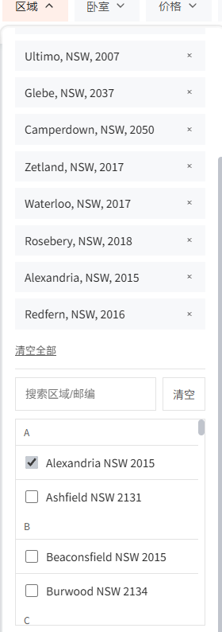

# 系统设计模式与最佳实践

---

## 核心架构原则

### 数据流架构 (Data Flow Architecture)
```bash
# 核心数据流路径 (必须遵守)
Browser (Vue @ :5173) → Vite Proxy → Python Backend (@ :8000)
```

**禁止** ❌: AI Agent直接调用前端或其他反向依赖
**原因**: 引入脆弱中间层，增加延迟，隐藏真正的错误源

---

## 前端架构

- **组件框架**: Vue 3 (Composition API)
- **状态管理**: Pinia (单一数据源原则)
- **路由系统**: Vue Router (SPA架构)
- **UI库**: Element Plus (JUWO主题定制)

---

## CSS与布局模式

### 1. 样式作用域
**模式** ✅: 将布局影响的CSS规则 (`overflow`, `position`, `display`) 限定在组件作用域内
**反模式** ❌: 对顶级元素 (`body`, `html`) 应用全局 `overflow-x: hidden`

### 2. 布局对齐策略
**模式** ✅: 统一 `max-width: 1200px` 和 `padding: 0 32px` 确保垂直对齐
**反模式** ❌: 不同容器的对齐方式不一致

### 3. 全宽内容设计
**模式** ✅: 双层结构实现：
- 外层容器: `width: 100%` (背景)
- 内层容器: 居中内容区

---

## 状态管理原则

**单一数据源**: 组件负责触发action，业务逻辑在store actions中处理

**反模式** ❌: 在action中混合传入参数和未同步的旧state

---

## 移动端响应式模式

### 1. 渐进式间距系统
匀速递增的间距级别：`8px → 12px → 16px`
从核心元素到区域再到容器的视觉层次递增

### 2. 移动端滚动逻辑隔离
桌面端 vs 移动端使用不同的滚动判断机制：
- **桌面端**: `getBoundingClientRect()` 视窗位置判断
- **移动端**: `offsetHeight` 实际DOM高度判断

### 3. 性能优化的高度计算策略
使用缓存的DOM高度信息而非实时计算，以避免强制布局重计算

### 布局与对齐
- 桌面端（≥1200px）正文容器不做水平居中，使用内容卡 .content-card 外边距计算实现精确对齐：
  - 左：margin-left = 453px - var(--section-padding-x, 50px)
  - 右：margin-right = 496px - var(--section-padding-x, 50px)
- 不在多处硬编码 453/496，统一以变量/计算表达，减少维护成本。
- 分隔线使用伪元素并锚定到正文内边距：left/right 以 var(--section-padding-x, 50px) 对齐。

### 文本可读性
- 超宽屏（默认 ≥1920px）对长段落仅限 p 的 measure（建议 68ch，可通过 --paragraph-measure 调整），不改变容器宽度与对齐，避免破坏地图/描述右缘一致性。

### 响应式与兼容
- <1200px 沿用移动端容器与内边距；Hero 大图始终全宽，自适应留白不受正文约束。
- 覆盖层样式优先级以“有限 !important + 更具体选择器”为主，控制影响范围。

### 变量化与可配置
- 关键变量：--section-padding-x（默认 50px）、--paragraph-measure（默认 68ch）。
- 调整对齐或行长时优先改变量，避免散点修改。

## 输入框后缀对齐模式（新增）
- 原则：后缀图标相对 `.el-input__wrapper` 绝对定位（position:absolute；right 使用令牌），文本占位通过 wrapper 的 `padding-right` 令牌化预留；禁止以 `.el-input__suffix` 作为定位锚点。
- 为什么：suffix-inner 常不占满，clearable/内部结构变化会导致“看起来靠左”或覆盖占位符；以 wrapper 为锚点稳健且易于令牌化。
- 实施：
  - `.el-input__wrapper { position: relative; padding-right: calc(var(--search-suffix-right, 12px) + var(--search-suffix-hit, 32px)); }`
  - `.filter-icon-btn { position:absolute; right: var(--search-suffix-right, 12px); top:50%; transform: translateY(-50%); }`
  - SVG 图标 `stroke: currentColor`，颜色用 `var(--color-text-secondary)`；a11y：button + aria-label。
- 令牌：
  - `--search-suffix-right`: 右内边距，默认 12px
  - `--search-suffix-hit`: 命中区域宽高，默认 32px（可调至 24–28px 以收紧命中范围）
- 溯源：activeContext 2025-09-06｜UI-SEARCH-FILTER-SUFFIX

## 移动端 Full-bleed 卡片模式（新增）
- 原则：移动端卡片支持“满屏贴边（full-bleed）”，改变宽度不改变高度；桌面端不受影响。
- 实施（@media ≤767px）：
  - `.property-card { width:100vw; max-width:100vw; margin-left:calc(50% - 50vw); margin-right:calc(50% - 50vw); border-radius:0; }`
  - 保持图片容器/轮播高度不变（例如 250px），`object-fit: cover`。
- 为什么：在移动端提供更沉浸的视觉，且不破坏既有内容节奏。
- 注意：full-bleed 与全站容器 32px 留白是两种视觉范式；优先以“组件局部”实现，不影响全局容器规则。
- 溯源：activeContext 2025-09-06｜UI-CARD-FULLBLEED-MOBILE

## 经验教训总结

- **CSS全局影响**: 全局 `overflow-x: hidden` 会破坏 `position: sticky`
- **滚动判断差异**: 移动端和桌面端需要隔离的滚动处理逻辑
- **布局统一**: 容器对齐不一致会导致视觉错位
- **状态同步**: 异步action中参数与state的不一致会导致数据错误

---

## API 设计与契约一致性（新增）

- 原则：相同资源的列表端点与详情端点必须返回一致的字段集合，详情端点应为列表端点的“超集”（superset），避免刷新或直链访问出现字段缺失导致的 UI 回退。
- 案例：`inspection_times` 需同时出现在 `/api/properties` 与 `/api/properties/{id}`。此次问题根因即为详情端点缺失该字段。
- 约束：
  - 新增字段时，优先在详情端点补齐，再在列表端点评估是否需要（考虑有效负载与性能）。
  - 任何字段移除/更名，必须通过后端兼容层或版本化保证向后兼容。
- 启用缓存（FastAPI Cache/Redis）时，更新接口契约后应提供选择性失效端点，避免旧缓存长期污染响应。
  - 统一响应格式校验：所有 REST 端点返回 {status, data, pagination, error}；将该结构纳入契约/快照测试，与 techContext.md 保持一致。
- 实施建议：
  - 在后端添加契约单元测试/契约快照测试，校验两个端点的字段一致性（至少对关键字段如 `inspection_times`）。
  - 在 PR 审查清单中加入“端点字段一致性检查”项。

## 前端样式一致性（新增）

- 页面背景与卡片
  - 页面背景统一使用 `var(--color-bg-page)`，卡片/表面背景使用 `var(--color-bg-card)`，保持“页灰 + 卡片白”的视觉层次与列表页一致。
- 栅格与容器
  - 桌面端（≥1200px）统一容器 `max-width: 1200px`，左右内边距 `32px`；1920px 超宽断点仅居中不改变主容器宽度，避免“另一套主题”的观感。
- 设计令牌约束
  - 禁止硬编码颜色/边框/阴影/字号，统一使用 `src/style.css` 中的 tokens：如 `var(--color-text-primary/secondary)`, `var(--color-border-default)`, `var(--juwo-primary)` 等。
  - 新增/引用 CSS 变量时，必须先在 `:root`（`src/style.css`）声明再使用；禁止使用未定义变量（避免样式回退）。
  - 对详情页使用到的 tokens 已补齐映射：如 `--space-*`, `--bg-*`, `--shadow-xs`, `--brand-primary`, `--text-*`, `--link-color`。
- 断点与响应式
  - 统一断点：`768px`（平板）、`1200px`（桌面）、`1920px`（超宽）。优先小范围覆盖，避免在断点内“大改”造成体系分裂。
- 兼容性原则
  - 样式调整不得修改组件逻辑与数据流；以最小变更保证与首页风格、节奏一致。

## 富文本渲染统一原则（PropertyDetail.description 实战沉淀）
- 原则：页面中的富文本一律使用统一的 Markdown 渲染组件（如 MarkdownContent），组件内部完成 XSS 清理与必要的轻量预处理（GFM、换行转 <br>、项目符号 •/- 归一），页面侧仅负责容器样式与交互（折叠/展开）。
- 为什么：避免在各视图重复手写 v-html，降低 XSS 风险；实现一致的列表/段落/强调/链接样式；便于全局升级与样式统一。
- 技术权衡：不额外引入新依赖，优先复用既有组件；在保持体积可控的同时兼顾可读性与安全性。
- 适用范围：PropertyDetail.description 以及后续所有富文本字段（如房源须知、注意事项等）。
- 溯源：activeContext 2025-09-05｜DOCS-ALIGN-FINAL（任务 RICH-TEXT-UNIFY）
- 落地状态：已在 PropertyDetail.description 应用；其它富文本按需迁移中。

## 图标系统与组件化 (Icon System & Componentization)

- **原则**: 全站图标统一使用 `lucide-vue-next` SVG 图标库，彻底弃用 Font Awesome (`<i>` 标签)。所有图标必须作为 Vue 组件导入和使用，并统一应用 `.spec-icon` 样式类。
- **为什么**:
    - **视觉一致性**: 确保全站所有图标风格、粗细、尺寸完全统一。
    - **性能**: SVG-in-JS 方案支持摇树优化 (tree-shaking)，只打包用到的图标，减小最终构建体积。相比之下，字体图标库需要加载整个字体文件。
    - **可维护性**: 通过组件化方式引用图标 (`<IconName />`)，代码更具可读性，且易于通过全局搜索进行管理和替换。
    - **样式控制**: SVG 图标可以通过 CSS (`fill`, `stroke`) 进行更精确的颜色、大小和动画控制，无需依赖 `font-size` 和 `color` 等hacky的文本样式。
- **实施规范**:
    - **导入**: `import { IconName } from 'lucide-vue-next'`
    - **使用**: `<IconName class="spec-icon" />`
    - **样式**:
        - 默认尺寸由 `.spec-icon` 全局控制 (e.g., `width: 24px; height: 24px;`)。
        - 特殊区域（如按钮、下拉菜单）可局部覆盖尺寸，但需保持比例，如 `.action-btn .spec-icon { width: 22px; height: 22px; }`。
        - 颜色通过 `color` 或 `fill` 属性继承或指定。
- **反模式** ❌:
    - 混合使用 Font Awesome 和 Lucide。
    - 使用 `<i>` 标签或图像文件作为图标。
    - 在组件内硬编码图标的 `width`, `height`, `color` 样式，破坏全局一致性。
- **溯源**: 本次从 `PropertyCard.vue` 到 `PropertyDetail.vue` 的图标统一重构工作。
- **迁移状态**: 进行中；允许过渡期例外，不作为阻断项。
- **迁移策略**: 对既有页面按需增量迁移，跨页面替换须评审；临时替换为其它图标库仅作为应急措施，修复后需恢复为 lucide。

## 计数器徽标（Pill/Badge）统一模式

- 原则：计数器应在不同位数（单位数/双位数/99+）下保持布局稳定，不产生横向抖动；组件为“非交互”视觉，不响应 hover。
- 结构：图标（可选）+ 文案（pill-label）+ 数字徽标（pill-badge）。推荐容器类名 `.image-counter`。
- 样式规范（像素复刻基线）：
  - 容器：display:inline-flex; align-items:center; justify-content:center; gap:8px; min-width:118px; height:40px; padding:0 14px; background:#fefefe; color:#3c475b; border:1px solid #cfd1d7; border-radius:4px; cursor:default; line-height:1; box-shadow:none; box-sizing:border-box。
  - 文案 `.pill-label`：white-space:nowrap; line-height:1;（避免垂直偏移）。
  - 数字 `.pill-badge`（默认）：22×22 圆形（width/height:22px; border-radius:100%），字体 12px/600；使用 `font-variant-numeric: tabular-nums`；`flex-shrink:0` 防止压缩。
  - 两位及以上（含 99+）：为 `.pill-badge.two-digits` 设置 `width:auto; padding:0 4px; border-radius:11px`，自动切换为椭圆胶囊。
- 数字规则：当计数 ≥ 100 时，显示 `99+`；当计数 ≥ 10 时，给数字徽标附加 `two-digits` 类。
- 可访问性：容器需提供 `aria-label` 描述（如“照片数量”），图标 `aria-hidden="true"`。
- 令牌化（可选）：若需与全局设计系统对齐，可将 #fefefe/#3c475b/#cfd1d7/#e6e9ed 替换为 `var(--color-bg-card) / var(--color-text-secondary) / var(--color-border-default) / var(--bg-secondary)` 等项目 tokens。
- 适用范围：图片计数器、收藏计数、通知气泡等具有相同特征的计数场景。
- 溯源：activeContext 2025-09-05｜UI-PILL-COUNTER（基于历史“成功过”的实现复刻与沉淀）

---

## 筛选入口一致性（更新 v1）

- 原则：筛选“单一真源”= FilterPanel + Pinia；FilterTabs 仅作为“入口/锚点”，不承载任何预设/快速选项/本地 applyFilters。
- 平台策略：
  - PC：显示 FilterTabs 分组 pill（区域/卧室/价格/空出时间）与“筛选”主按钮；点击任一项仅打开 FilterPanel，并传递分组意图。
  - Mobile：仅保留“筛选”主按钮；不显示分组 pill，避免拥挤。
- 事件契约：
  - FilterTabs → emit('requestOpen', { section: 'area'|'bedrooms'|'price'|'availability'|null })
  - 父(HomeView) → 接收后：showFilterPanel = true；focusSection = payload.section
  - FilterPanel → props: focusSection（将滚动/聚焦到对应分组），v-model:open 控制显隐
- 数据契约：
  - 任何筛选更改仅在 FilterPanel 内部提交到 Pinia，并按需同步 URL；禁止在 FilterTabs 直接改 store 或 query。
- 可达性与视觉：
  - 遵循 EP-GUARDRAIL-FOCUS-GLOBAL；当 focusSection 变化时聚焦该分组首交互控件（仅PC）。
- 回滚策略：
  - 如需撤回 PC chips，移除 FilterTabs 渲染即可恢复“搜索后缀图标为唯一入口”的形态。
- 溯源：activeContext 2025-09-07｜FILTER-TABS-PC-RETURN（代码已落地）；待补：FilterPanel.focusSection

## 筛选入口一致性（v2·PC 专用，覆盖 v1 的 PC 策略）
参见：分离式筛选面板尺寸与无内滚（卧室 380px，其他 520px；内部不出现滚动条）。
- 目标：PC 端移除“筛选”主按钮；仅保分组 Chips（区域/卧室/价格/空出时间）+“更多”承载高级项。
- 交互：点击任一 Chip 打开对应独立面板；“更多”打开高级筛选面板；各面板只负责收集条件与应用/重置。
- 数据真源：仍以 Pinia 为唯一真源（apply/reset 在 store 层统一处理），并按需同步 URL；禁止在 Chips 内直接改 store state。
- 可达性：遵循 EP-GUARDRAIL-FOCUS-GLOBAL；打开时聚焦面板首交互控件；Esc/点击遮罩关闭。
- 回滚策略：若需回退到“统一 FilterPanel”形态，仅需将 Chips 触发恢复为 requestOpen(section) 并渲染统一 FilterPanel。

### PC 分离式筛选实现细则（补充）
- 容器与挂载
  - 使用 FilterDropdown 作为通用下拉容器，teleport 到 body，避免层级干扰；overlay 支持 @click.self 关闭；仅允许单例面板同时打开（activePanel 单一）。
  - 面板显隐采用 :modelValue 与 @update:modelValue 事件对偶，而非 v-model 布尔表达式（修复 v-model LHS 规范问题）。
- 事件契约（PC/Mobile 分治）
  - PC：FilterTabs 内部管理 activePanel 与触发 refs（area/bedrooms/price/availability/more），不对 store 与 URL 做直接写入。
  - Mobile：FilterTabs 通过 emit('requestOpenFullPanel') 通知父级打开统一 FilterPanel；HomeView 接收后仅在移动端断点下打开；PC 忽略该触发。
- 定位与滚动
  - 下拉定位基于触发元素 getBoundingClientRect()，保证 minWidth≥触发宽度；max-height: calc(100vh - 40px)；overscroll-behavior: contain 防滚动穿透。
  - 关闭条件：点击外部、Esc、断点切换到移动端时强制关闭。
- 可达性
  - 打开时将焦点置于面板首个可交互元素；Esc 关闭；Tab 流顺序仅在面板内可达（必要时增加焦点陷阱）。
- 风险与回滚
  - 该实现与 Mobile 统一面板并存，按断点切换；移除 FilterTabs 或改回触发统一面板即可回滚。

## 前端状态同步与特性开关（新增）

- 原则：以“映射函数 + 特性开关”的方式进行 V1 → V2 契约演进，默认关闭新契约，保障回滚路径。
- 为什么：避免一次性切换导致的全站耦合风险；在验证窗口期内可快速切换回旧契约。
- 实施：
  - 在 store 层集中构造参数（mapFilterStateToApiParams），组件仅触发 action；
  - 通过 enableFilterV2 控制输出参数集合（V1: suburb/minPrice/...；V2: suburbs/price_min/...）；
  - 任何异常场景下可一键回退，确保向后兼容。
- 溯源：activeContext 2025-09-05｜FILTER-EXPERIENCE-STACK

## 更多高级筛选模式（新增）
- 原则：PC 端“更多”面板承载高级条件（furnished/bathrooms_min/parking_min）；仅在“应用”时提交到 Pinia；URL 仅写入非空参数。
- 定位与交互：沿用分离式下拉（FilterDropdown）显式坐标策略、单例打开、ESC/外点关闭；打开时首控件获焦点，Tab 顺序在面板内闭环。
- 数据契约：组件传入 isFurnished/bathrooms/parking 等键；Store 侧 mapFilterStateToApiParams 在 V2 下映射为 furnished/bathrooms_min/parking_min，V1 下透传且可被后端忽略。
- 特性开关：默认 enableFilterV2=false；当检测到“高级键”（isFurnished/bathrooms/parking/postcodes）时，按需启用 V2 映射，保障无痛回滚。
- URL 同步：仅写入 isFurnished=1、bathrooms=3+、parking=2+ 等非空值；刷新/直链可复现（读取逻辑可按需补充）。
- 回滚策略：移除 FilterTabs 中对 MoreFilterPanel 的注册即可回退为占位；或关闭 V2 映射开关恢复旧契约。
- 溯源：commit 7535437｜FILTER-MORE-PANEL-PC

## 分离式下拉定位模式（新增）
- 原则：PC 分离式筛选使用“显式坐标优先”的定位策略，彻底规避 ref/布局时序导致的 0,0 问题。
- 触发侧（FilterTabs）：
  - 在点击事件中使用 currentTarget.getBoundingClientRect() 计算 { top: rect.bottom + 8, left: rect.left, width: max(rect.width, 280) }；
  - 做左右 10px 视口边缘保护；窗口 resize 时若面板打开则重算；切至移动端断点（≤768px）强制关闭。
- 面板侧（FilterDropdown）：
  - 新增 props explicitPosition（{top,left,width}），若提供则优先使用，忽略 trigger 未就绪的影响；
  - 修正 updatePosition 的 early-return：仅当“无 explicitPosition 且无 trigger”时才早退；
  - 仍保留 trigger + getBoundingClientRect() 作为回退；首开追加 1–2 帧 rAF 轻量确认重算，稳住首帧。
- 布局与层级：
  - teleport 到 body，容器 position: fixed；max-height: calc(100vh - 40px)；overscroll-behavior: contain 防穿透；
  - 仅允许单实例打开；点击外部/ESC 关闭；断点切换时自动关闭。
- 风险与回滚：
  - 删除 explicitPosition 传参即可回退到 trigger 测量模式；early-return 恢复旧逻辑仍可运行但可能出现 0,0。
- 溯源：activeContext 2025-09-08｜FILTER-DROPDOWN-POSITION-FIX

---

## 滚动与滚动条显示原则（新增）

- 原则：抽屉/侧栏类容器仅保留“一个主纵向滚动条”；打开面板时锁定 body 滚动，避免出现页面滚动条与面板滚动条并列。
- 滚动链控制：对面板与其内容区使用 `overscroll-behavior: contain`，阻断滚动穿透到底层页面或父级容器。
- 内部长列表：允许局部滚动，但默认隐藏其滚动条条形（保留滚动能力），避免与主滚动条并列出现在右缘；或将滚动职责合并为面板主滚动。
- 品牌色约束：滚动条/指示器统一中性灰，不得使用品牌色（品牌色仅用于 CTA）。
- 变量化：统一使用 `--neutral-scrollbar-color / --neutral-scrollbar-hover-color` 管理滚动条颜色；必要时在组件内使用 `:deep` 精确覆盖。
- 回滚策略：删除对应覆盖块即可回退；不影响逻辑层。
- 实施建议：
  - 样式（全局）：隐藏/中性化 Element Plus `el-scrollbar` 与原生滚动条条形
    ```css
    /* 全局中性化（已落地，摘录） */
    :root {
      --neutral-scrollbar-color: #c0c4cc;
      --neutral-scrollbar-hover-color: #909399;
    }
    .el-scrollbar__thumb { background-color: var(--neutral-scrollbar-color) !important; }
    .el-scrollbar__thumb:hover { background-color: var(--neutral-scrollbar-hover-color) !important; }
    /* 面板内定向兜底：仅显示主滚动条，内部列表条形隐藏 */
    .domain-filter-panel :deep(.el-scrollbar__bar) { background: transparent !important; }
    .location-section :deep(.el-scrollbar__bar) { display: none !important; }
    .location-section :deep(.el-scrollbar__thumb) { background: transparent !important; }
    ```
  - 逻辑（组件）：在面板显示时锁定 body 滚动，关闭时恢复
    ```js
    // 中文注释：锁定 body 滚动，防止页面滚动条与面板滚动条并列
    const lockBodyScroll = () => {
      document.documentElement.style.overflow = 'hidden'
      document.body.style.overflow = 'hidden'
    }
    const unlockBodyScroll = () => {
      document.documentElement.style.overflow = ''
      document.body.style.overflow = ''
    }
    watch(visible, (on) => { on ? lockBodyScroll() : unlockBodyScroll() })
    onUnmounted(() => unlockBodyScroll())
    ```
- 溯源：activeContext 2025-09-08｜UI-EP-SCROLL-NEUTRAL-1

## 分离式筛选面板尺寸与无内滚（新增）
- 原则：PC 端分离式筛选面板内部不出现滚动条；通过控量与压缩留白控制高度，仍遵循“仅一个主纵向滚动条”的系统原则。
- 尺寸：PC 端所有筛选面板统一宽度为 380px；移动端最小宽度不少于触发器宽度（≥280px）。
- 实施：
  - FilterTabs.computePosition(el)：PC 下统一 width=380，并做左右 10px 视口边缘保护。
  - 面板内部通过压缩留白与间距控制总高（示例：panel-content padding 12px；按钮组 gap 8px；section margin-bottom 8/16；三组各一行），整体高度≈320–360px，确保不触发内部滚动。
  - PC 日期输入内部间距与令牌基线（仅 .filter-dropdown-container 作用域）：
    - --filter-suffix-hit: 20px；--filter-suffix-right: 8px；--date-field-min-ch: 10ch
    - 输入包装 padding-left: 8px；:deep(.el-input__suffix-inner) gap: 0
    - .date-picker-group 不换行，column-gap: 6px；“至”分隔 margin: 0 2px
    - 保留 1px 中性灰焦点环；禁黑色 UA outline（面板内）
  - “应用（N）”计数采用 300ms 防抖，加载态禁点；错误快速失败，不做本地估算，保持可观测性。
- 溯源：commit 9627f697｜FILTER-PANELS-UNIFY-380

## 导航交互统一（新增）

- 作用范围：仅在“导航容器”内的链接生效（nav / header nav / .nav / .navbar / .navigation / .top-nav / .bottom-nav / [class*="nav"]）
- 行为准则：
  - hover：color: var(--juwo-primary)；font-weight: inherit（不加粗）；background: transparent（不要灰底）
  - focus / focus-visible：outline: none；box-shadow: none（仅导航链接移除，表单控件仍保留灰色可见焦点）
  - 图标：color/fill/stroke: currentColor（图标随文字颜色变化）
- 变量：在 :root 定义 `--nav-hover-color: var(--juwo-primary)` 统一管理
- 与 Element Plus 的关系：覆盖导航容器内 `.el-menu-item:hover` 默认灰底为透明，仅改文字颜色
- 可访问性权衡：满足“点击后不要浅灰外框”的品牌要求，仍保证表单/输入等交互组件的可见焦点与键盘可达性
- 风险与回滚：
  - 若个别非导航模块类名包含“nav”被误伤，可通过更精确选择器限定或在局部覆写
  - 该规则块为追加内容，可整体删除快速回退
- 溯源：progress 2025-09-06｜UI-NAV-GLOBAL-RULES（已落地）

## 分页参数防串扰（新增）

- 原则：计数请求（page_size=1）与列表请求必须彻底解耦；列表请求的 page/page_size 由“当前分页状态”显式决定，任何历史参数与缓存不得覆盖。
- 为什么：计数端为了性能采用 page_size=1，若污染到列表端会出现“总数正确、每页仅 1 条”的异常。
- 实施模式（Pinia）：
  1) applyFilters(filters) 在保存 currentFilterParams 前强制写入：`page=1`、`page_size=this.pageSize`（使用当前每页设置，禁止硬编码）。
  2) fetchProperties(params) 合并 `currentFilterParams` 与本次 `paginationParams` 后，显式覆盖：
     ```js
     requestParams.page = paginationParams.page
     requestParams.page_size = paginationParams.page_size
     ```
     以本次分页为最高优先级，防止历史值（含 1）污染。
  3) setCurrentPage(page) 与 setPageSize(size) 调用 fetchProperties 时显式传 `{ page, page_size }`。
- 反模式 ❌：在组件侧直接拼接部分参数调用列表接口，绕开 store 的统一构造与守卫。
- 溯源：activeContext 2025-09-06｜FILTER-PAGINATION-GUARD｜commit 23f186f

## Location 回显与空态规则（新增）

- 原则：FilterPanel 顶部常驻“区域 Location”区，保证用户在筛选面板内始终能看到当前区域选择的上下文。
- 行为：
  - 有选区：以灰色 chips 回显，支持单项移除与“清空全部”。
  - 无选区：显示友好空态（提示“未选择区域”与弱链接“去选择区域”），避免清空后整块消失造成心智断裂。
  - include_nearby：勾选项常驻该区，写入/恢复 URL（include_nearby=1/0），作为透传参数（后端未识别时无副作用）。
  - i18n 回退：`filter.location/clearAll/searchNearby` 等 key 缺失时使用中文回退，禁止直出 key。
- 事件命名：统一采用 kebab-case `open-filter-panel`（必要时兼容 camelCase），避免 DOM 事件大小写差异带来的监听失败。
- 溯源：activeContext 2025-09-06｜FILTER-PANEL-LOCATION-SECTION｜commit 23f186f

## 搜索框内嵌标签（Inline Chips）规则（新增）

- 目的：在首页搜索框“内部”低调回显所选区域，避免在搜索框“上方”使用品牌色条幅干扰版面。
- 展示条件：未聚焦、未输入、未打开移动 Overlay 且存在选区。
- 视觉与交互：
  - 浅灰 chip（中性边框/文字），前 2 项 + “+N” 汇总；单行，右侧渐变遮罩避免硬切。
  - `pointer-events: none`，只做占位与信息回显，不拦截输入与点击（交互仍由输入框接管）。
- 数据真相源：仅回显 Pinia `selectedLocations`；实际请求以 applyFilters 确认并持久化到 `currentFilterParams` 为准。
- 溯源：activeContext 2025-09-06｜SEARCHBAR-INLINE-CHIPS｜commit 23f186f

## Netlify 部署与发布模式（新增）
- 原则：Monorepo 子目录构建；生产为 SPA 应用需启用 200 重写。
- 配置：
  - netlify.toml:
    - [build] base="vue-frontend"、command="npm run build"、publish="dist"
    - [[redirects]] from="/*" to="/index.html" status=200（SPA 重写）
  - Functions：未使用时保持为空，避免误判为函数项目。
  - Node 版本：遵循 package.json engines（20.19.x 或 22.x），必要时在 Netlify 环境变量中声明 NODE_VERSION。
- 触发策略：
  - 生产分支 push 自动构建与发布；若未触发，优先检查 Repository 绑定/Branch to deploy/Auto publish/Lock/Ignore/GitHub App 权限；必要时以 Build Hook 兜底。
- 溯源：activeContext 2025-09-06｜DEPLOY-NETLIFY-CONFIG｜commit f375181..b227da3

## 构建红线：Vue SFC 单模板（新增）
- 原则：单文件组件（SFC）仅允许一个 <template> 块。
- 违例后果：Vite 在解析阶段报错，中断 Rollup，CI/CD 失败。
- 检查建议：提交前本地执行 vite build 验证；若需附加模板片段，请合并到主模板或拆分为子组件。
- 溯源：activeContext 2025-09-06｜BUILD-FIX-SFC｜commit f375181..b227da3

## URL 状态同步（新增）

- 原则：筛选应用后将状态写入 URL；进入页面时从 URL 恢复（刷新/直链可复现）。
- 为什么：便于分享筛选结果与回溯问题；保证可观测与可复现。
- 实施建议：
  - 仅持久化“非空参数”，避免污染 URL；
  - 写入前做“幂等比对”，避免无穷 replace 循环；
  - 解析时对异常/空值做兜底（try/catch + 判空）。
- 溯源：activeContext 2025-09-05｜FILTER-EXPERIENCE-STACK

## 错误处理与降级策略（新增）

- 原则：快速失败 + 就近 Toast 提示，禁止静默失败与本地估算。
- 为什么：静默/伪数据会掩盖真实错误源，降低可观测性与用户信任。
- 实施：
  - 计数/列表失败时弹出 ElMessage；不将计数强行置 0；
  - 去除本地估算逻辑，所有数据以后端真实值为准。
- 溯源：activeContext 2025-09-05｜FILTER-EXPERIENCE-STACK

## 地域筛选契约（新增）

- 原则：suburbs 与 postcodes 分离为两类 CSV 参数，分别表达“区域名”与“邮编”。
- 为什么：避免语义混淆；便于后端针对性索引与过滤。
- 实施：
  - URL 与筛选透传区分 suburb/suburbs 与 postcodes；
  - V2 映射开启后输出 postcodes=CSV；未开启时可忽略不传，保持兼容。
- 溯源：activeContext 2025-09-05｜FILTER-EXPERIENCE-STACK

## 轻量 i18n 策略（新增）

- 原则：默认 zh-CN，以轻量 $t 访问（可平滑切换至 vue-i18n）。
- 为什么：在不引入新依赖前提下消除硬编码文案，便于未来多语言。
- 实施：
  - 提供 src/i18n/index.js 轻量插件，暴露 $t 与 inject('t')；
  - 新增文案以命名空间组织（如 filter.*），组件使用 $t('ns.key')。
- 溯源：activeContext 2025-09-05｜FILTER-EXPERIENCE-STACK

## 性能观测（新增）

- 原则：以简易埋点监控关键接口耗时阈值（如 p95 800ms）。
- 为什么：在无后端 APM 的情况下，前端仍需具备“足够的现场证据”进行优化闭环。
- 实施：
  - 在 fetchProperties/applyFilters/getFilteredCount 处打印超过阈值的警告日志 [FILTER-PERF]；
  - 若持续超阈，考虑后端提供轻量 count 端点或索引优化。
- 溯源：activeContext 2025-09-05｜FILTER-EXPERIENCE-STACK
