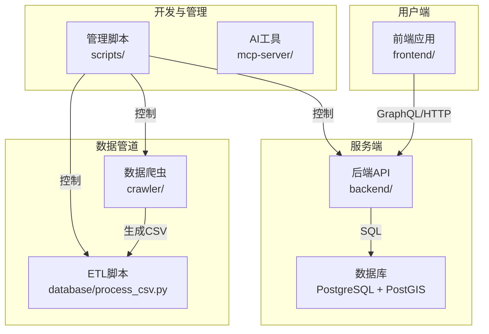
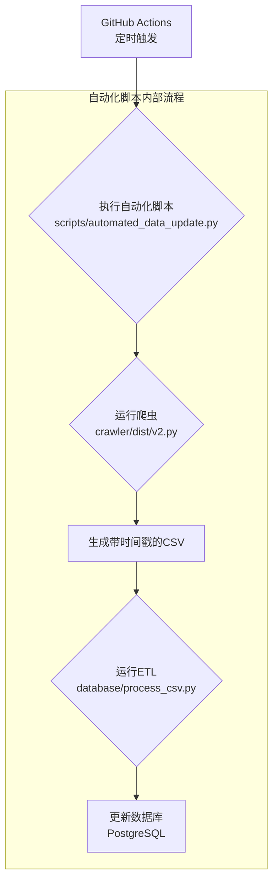

# 系统架构模式 (systemPatterns.md)

**最新更新**: 2025年7月10日

## 1. 整体架构

### 架构风格
- **模块化分离架构**: 前端、后端、爬虫、数据库、脚本等完全分离。
- **服务协同**: FastAPI后端 + 前端应用 + 数据爬虫。
- **GraphQL API中心**: 使用GraphQL进行数据查询和操作。

### 系统组件关系


## 2. 核心设计模式

### 数据访问模式
- **Repository Pattern**: 数据访问层抽象，便于测试和维护。
- **GraphQL Schema First**: 先定义GraphQL schema，再实现resolver。
- **地理空间数据处理**: 使用PostGIS扩展处理地理位置和距离计算。

### API设计模式
- **GraphQL单端点**: 所有数据查询通过单一GraphQL端点。
- **类型安全**: 使用Strawberry-GraphQL确保类型安全。

### 前端架构模式
- **组件化开发**: 将UI拆分为可复用的组件。
- **状态管理**: 使用localStorage进行客户端状态持久化。
- **响应式设计**: 使用Tailwind CSS实现移动端适配。

## 3. 数据流模式

### 房源搜索流程
```
用户输入 → 前端验证 → GraphQL查询 → 后端处理 → 数据库查询 → 地理计算 → 结果排序 → 返回前端 → UI渲染
```

### 自动化数据更新流程 (ETL)


## 4. 关键技术决策

- **FastAPI**: 因其高性能、自动文档和原生异步支持而被选择。
- **GraphQL**: 因其灵活的数据查询、强类型系统和减少网络请求的优势而被选择。
- **PostgreSQL + PostGIS**: 因其强大的地理空间支持、稳定性和事务一致性而被选择。
- **模块化目录**: 为了清晰地分离不同部分（前端、后端、爬虫等）的关注点，使项目更易于维护和扩展。

## 5. 安全与扩展性

- **安全**: 使用JWT进行认证，所有API通信强制HTTPS，通过参数化查询防止SQL注入。
- **扩展性**: 后端服务无状态，支持水平扩展；前端资源可通过CDN部署。
