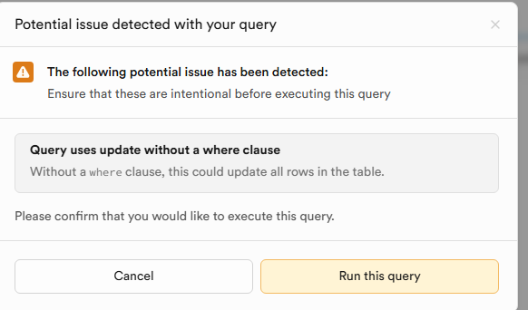

# 家具标注规范化与回归验证（is_furnished 正规化）

目的
- 解决历史数据将 is_furnished 写为 'yes'/'no'/'unknown' 的问题，避免“文案无家具却被判为有家具”的错误。
- 保证端到端语义一致：ETL 清洗 → 入库 → 查询/索引 → API → 前端表现。

已完成的系统改造
1) ETL 更新路径覆盖 is_furnished（database/process_csv.py）
   - 新增 derive_is_furnished（否定 > 模糊/条件 > 肯定；冲突→NULL；无证据→NULL）
   - 新增 USE_ETL_FURNISHED 开关（默认 true，异常时可回退旧逻辑）
   - 新增 furnishing_overrides.json 点名覆盖（开发期热修单条）
   - 清洗阶段将 is_furnished 标准化为布尔/NULL（未知 → NULL），最终以集中判定 + overrides 为准
   - 更新阶段将 is_furnished 纳入 UPDATE SET，覆盖旧的字符串残留。

2) 列表 API 兼容 furnished 键，并支持 listing_id 点名过滤（backend/main.py）
   - furnished=true 等价 isFurnished=true，避免不同入口漏筛。
   - listing_id 支持点名自测，校验单条筛选效果。

3) 详情 API 返回 is_furnished 字段（backend/main.py）
   - 便于直接查看单条的真实标注。

一次性规范化迁移（务必执行）
- 位置：database/migrations/2025-09-13-fix-is-furnished.sql（历史清洗） + database/migrations/2025-09-13-fix-feature-booleans.sql（Phase 1：统一 is_furnished 为 BOOLEAN）
- 作用：全库将 'yes'/'no'/'unknown' 等文本规范化为布尔/NULL，并事务化地将 is_furnished 列统一为 BOOLEAN（TRUE/FALSE/NULL），阻断字符串回流。

执行步骤
A) 进入数据库（任选其一方式）
- psql：
  psql "$DATABASE_URL"
- Supabase SQL Editor：复制脚本到控制台执行
- pgcli / DBeaver：按工具使用方法执行脚本

B) 运行迁移脚本（顺序执行）
- 1) database/migrations/2025-09-13-fix-is-furnished.sql：执行 Step 1（规范化历史文本值→布尔/NULL）；可选 Step 2（强制列为 BOOLEAN）
- 2) database/migrations/2025-09-13-fix-feature-booleans.sql：执行预清洗 + DROP CHECK + ALTER TYPE（幂等，失败即回滚）
- 若尚未创建布尔部分索引，可参考 database/optimize_indexes.sql

缓存失效（保证前端表现立即一致）
- 选择性清理单条：
  curl -X POST "http://localhost:8000/api/cache/invalidate?property_id=17580846"
- 全量失效（谨慎）：
  curl -X POST "http://localhost:8000/api/cache/invalidate?invalidate_all=true"

回归验证清单（前端表现）
1) 详情自检：
   - http://localhost:8000/api/properties/17580846
   - 应返回 data.is_furnished 为 true/false/null，不再出现 'yes' 等文本。

2) 点名 + 家具筛选自检：
   - http://localhost:8000/api/properties?listing_id=17580846&isFurnished=true&page=1&page_size=1
   - 若该条不是“有家具”，应返回空集合。

3) 列表筛选（全局）：
   - 勾选“带家具”，Network 面板确认 Query Params 含 isFurnished=true（或 furnished=true）。
   - 列表中不应出现 is_furnished = NULL/"unknown" 的记录。

回滚与风险
- 迁移脚本 Step 1 幂等，可重复执行无副作用。
- 将列类型强制为 BOOLEAN 后，如需回退：
  ALTER TABLE properties ALTER COLUMN is_furnished TYPE TEXT USING (CASE WHEN is_furnished IS TRUE THEN 'true' WHEN is_furnished IS FALSE THEN 'false' ELSE NULL END);
  （不建议回退至 TEXT，会破坏一致性）。
- ETL 改动为增量覆盖，若需停用可暂时将 UPDATE 语句中的 is_furnished = %s 行注释，但不建议（会放任旧值残留）。

FAQ
- Q：明明文案没写家具，为什么被算“有家具”？
  A：历史旧值 'yes' 留在库里且更新不覆盖；执行迁移与使用新 ETL 后会统一规范，不再发生。
- Q：前端是否需要改？
  A：无需。后端已兼容 furnished 键，避免参数不一致导致未筛选。
- Q：索引是否需要？
  A：建议设置部分索引（TRUE/FALSE）提升筛选性能，见 database/optimize_indexes.sql。

联系与溯源
- 变更范围：database/process_csv.py、backend/main.py、database/migrations/2025-09-13-fix-is-furnished.sql
- 问题来源：历史数据与更新路径未覆盖导致旧值残留
- 当前方案：一次性迁移 + 增量覆盖，且保持向后兼容（不改前端交互）。
